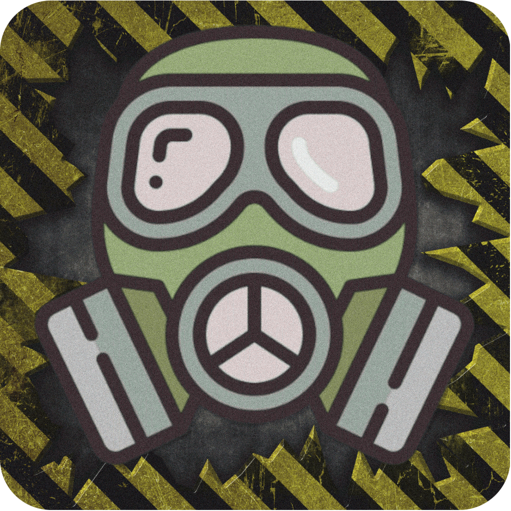

# Urbanaut-Backend-API

  

---

Social network for urban explorers - stalkers, diggers and so on.

## Stack

## Status

**V0.0.1 - Active Development 🟢**

## License

This software is developed under the Urbanaut License. See the bundled [LICENSE](LICENSE) file for details.